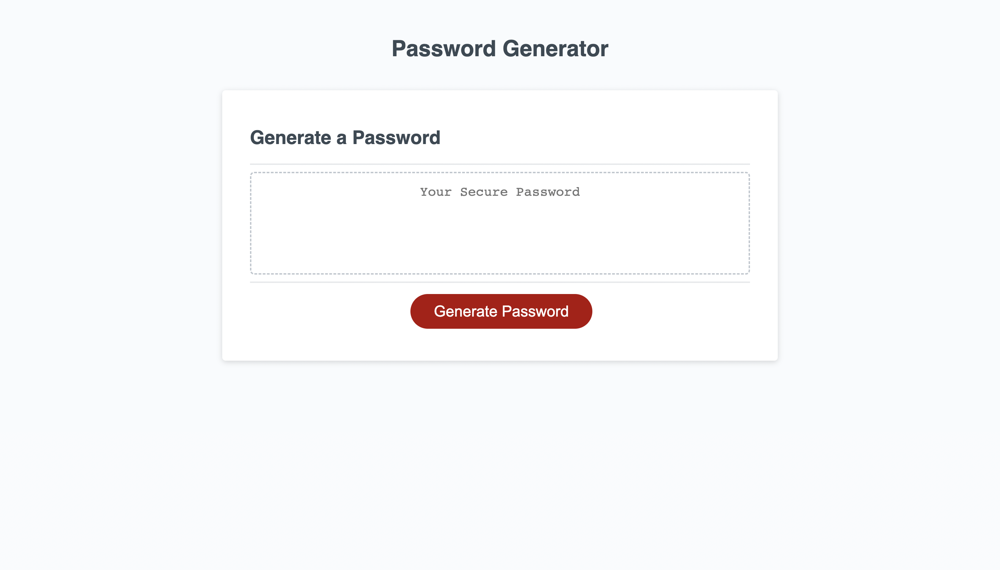

# KeyVaultGenerator

## Description
The motivation for this web application is to be able to generate a password with given password critrea that the user chooses for the password. The user can choose upper, lowercase characters, numeric, and special character. Inspect to look at code!
Github Portfile: https://github.com/JR728/KeyVaultGenerator

## Installation
N/A
## Usage
The website https://jr728.github.io/KeyVaultGenerator/ press the generate button and prompt will show asking how long you want your password to be and the type of characters you want in the passwords.

## Images

## Credit
the starter code for the password generator https://github.com/coding-boot-camp/friendly-parakeet
## License
MIT